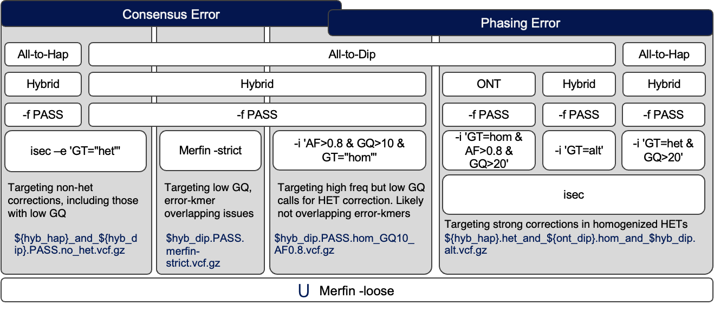

# SNV Candidates

Select final set of variants for SNV polishing and build consensus.

This is an updated version of the SNV correction, mainly targetting consensus error and phasing error (homogenized heterozygous variants) that were frequently observed in Verkko v1.4-v2.2.1 diploid assemblies. Variant calls were made using scripts in [deepvariant](https://github.com/arangrhie/T2T-Polish/tree/master/deepvariant) and [winnowmap](https://github.com/arangrhie/T2T-Polish/tree/master/winnowmap).

## Input
* sequence.fa : Target assembly to polish
* ver : Version of the assembly to polish
* ont_to_dip.vcf.gz : DeepVariant calls of the ONT reads to the target diploid assembly
* hybrid_to_dip.vcf.gz : HiFi and Illumina DeepVariant hybrid calls to the target diploid assembly
* hybrid_to_hap1.vcf.gz : HiFi and Illumina DeepVariant hybrid calls to the target hap1 assembly
* hybrid_to_hap2.vcf.gz : HiFi and Illumina DeepVariant hybrid calls to the target hap2 assembly
* hybrid.k31.meryl : Hybrid k-mer db for Merfin
* peak : `kcov` of the hybrid.k31.meryl obtained with GenomeScope2

## Output
* Intermediate VCF files of the SNV edit candidates
* `snv_candidates.merfin-loose.vcf.gz` final SNV edits
* New consensus `{next_ver}.dip.fa` and chain file `${ver}_to_${next_ver}.chain`

## Workflow
Variant calls are filtered and merged as described in [Yoo et al (2025)](https://www.nature.com/articles/s41586-025-08816-3) Supplementary Figure II.7.

## Legacy CHM13 polishing
Please refer to the [Error Detection](https://github.com/marbl/CHM13-issues/blob/main/error_detection.md) for the legacy CHM13 SNV and SV polishing.
